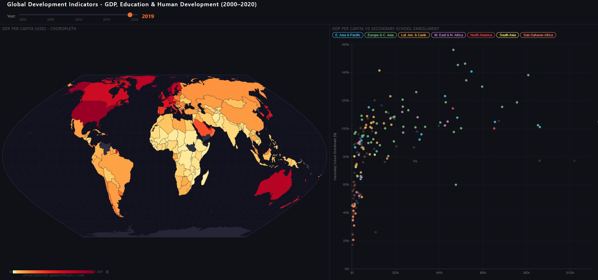
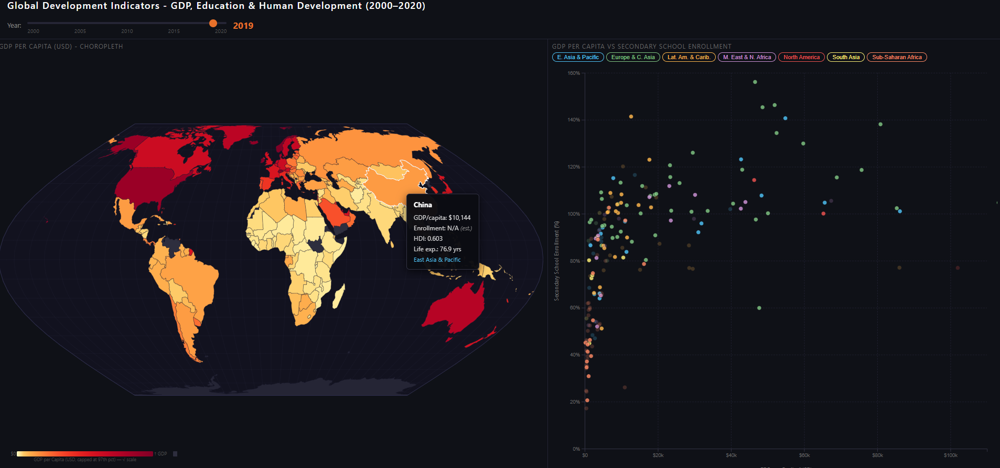

# Global Wealth and Human Development Visualisation

An interactive D3.js visualisation developed for MSc Artificial Intelligence Data Visualisation coursework at King's College London. It explores country-level wealth, education, and human-development patterns from 2000 to 2020 through linked geographic, statistical, and temporal views.



## What the application shows

The left panel is a choropleth of GDP per capita. The right panel plots GDP per capita against secondary-school enrolment, with colour identifying World Bank regions.

The implemented interactions are:

- a year slider that updates both views from 2000 through 2020;
- country hover tooltips in both views for GDP per capita, enrolment, HDI, life expectancy, and region;
- country selection from either view, linking the views by highlighting the map and drawing that country's scatter-plot trajectory;
- regional filter buttons for isolating or comparing geographic groups; and
- animated transitions as the selected year changes.



## Visual design

- **Geographic view:** an equal-area Eckert VI projection preserves area comparison better than a Mercator projection. GDP per capita uses a sequential YlOrRd scale because the variable is ordered.
- **Colour scaling:** the colour domain is capped at the 97th percentile and transformed with a 0.4 power exponent. This reduces domination by very high-income outliers while retaining contrast among lower-income countries.
- **Statistical view:** a linked scatter plot uses linear axes for GDP per capita and gross secondary-school enrolment. Region is encoded with a categorical colour scale.
- **Time:** the shared year slider provides an annual snapshot, while country focus mode adds a 2000-2020 trajectory for longitudinal inspection.

The visualisation is exploratory. It shows associations and geographic patterns; it does not establish causal relationships.

## Data preparation

The implemented preprocessing pipeline reads two local coursework inputs:

1. Global_Development_Indicators_2000_2020.csv supplies country, region, GDP per capita, HDI, life expectancy, population, and fallback enrolment fields.
2. world-education-data.csv supplies the preferred secondary-school enrolment field.

The script filters to ISO3 country codes and 2000-2020, left-joins the enrolment data by country and year, records which source supplied enrolment, maps ISO3 codes to the numeric identifiers used by the map geometry, and writes a nested country/year dataset.

The committed derived dataset contains 217 country objects and 4,548 country-year records. Missing numeric observations are written as JSON null values, and strict serialisation rejects NaN or Infinity.

Raw coursework and module-provided CSV files are not redistributed here. The separate mean-years-of-schooling-long-run.csv file was used for analytical comparison in the report but is not read by the implemented web-application pipeline.

## Run locally

The application must be served over HTTP so the browser can fetch the JSON files:

```bash
python -m http.server 8000
```

Then open http://localhost:8000 in a browser. The page loads D3, TopoJSON, and the Eckert VI projection helper from public CDNs, so an internet connection is required for those libraries.

## Rebuild the derived dataset

Obtain the two raw inputs under their original access and redistribution terms, then keep them outside the repository.

```bash
python -m venv .venv
python -m pip install -r requirements.txt
python preprocess.py --source-dir "path/to/coursework/Software"
python scripts/validate_data.py
```

The source directory must contain:

- Global_Development_Indicators_2000_2020.csv
- world-education-data.csv

By default, preprocessing writes data/countries.json. Use --output to select another derived-output path.

## Validation

```bash
python scripts/validate_data.py
```

The validator strictly parses every committed JSON file, rejects non-standard numeric tokens, checks the country/year schema, and confirms the expected country and record counts.

## Data sources and attribution

- The primary coursework input is [Global Development Analysis (2000-2020) by Michael Matta on Kaggle](https://www.kaggle.com/datasets/michaelmatta0/global-development-indicators-2000-2020). Its data card describes a dataset curated from public data through Google BigQuery; the coursework report identifies World Bank development indicators as the principal underlying source.
- The [World Bank World Development Indicators](https://datacatalog.worldbank.org/search/dataset/0037712/world-development-indicators) provide the underlying economic and development context described in the report.
- Map geometry is from [TopoJSON World Atlas](https://github.com/topojson/world-atlas), derived from Natural Earth country boundaries.
- [Our World in Data's average-years-of-schooling series](https://ourworldindata.org/grapher/mean-years-of-schooling-long-run), based on Barro-Lee and Lee-Lee research, informed report-level comparison but is not part of the implemented preprocessing pipeline.

The exact upstream source and redistribution terms for the coursework-supplied world-education-data.csv file have not yet been independently verified. That raw file is therefore not included. The committed countries.json is a derived visualisation dataset; its continued public redistribution should be reviewed alongside the source terms before a licence is chosen.

## Limitations

- Coverage is restricted to 2000-2020 and to records that can be mapped through the project's ISO code lookup.
- Secondary-school enrolment remains missing for 1,468 of 4,548 country-year records after the two input sources are combined.
- Gross enrolment can exceed 100 percent because it may include over-age and under-age students.
- GDP per capita is a national average and does not represent within-country inequality.
- Mixed source coverage and annual resolution limit direct comparability across every country and year.
- The views support exploratory association and comparison, not causal or predictive conclusions.

## Repository structure

```text
index.html                 Linked D3 visualisation
preprocess.py              CSV joining and strict derived-JSON generation
data/countries.json        Committed derived country/year data
data/world-110m.json       TopoJSON map geometry
scripts/validate_data.py   Strict JSON and schema validation
assets/                    Public-safe application screenshots
```

No licence has been selected for this repository.
